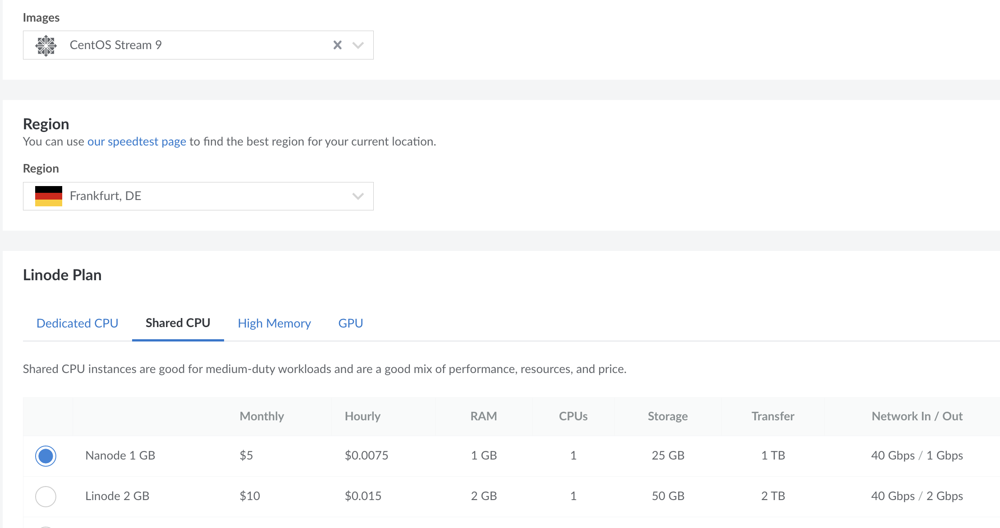
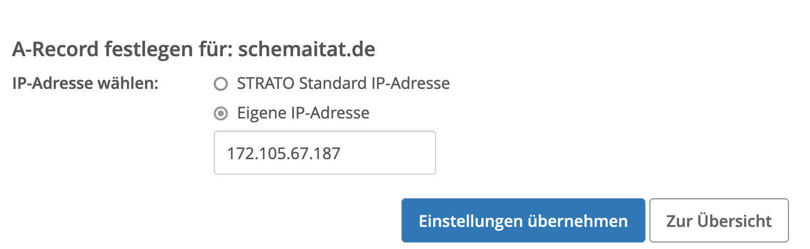
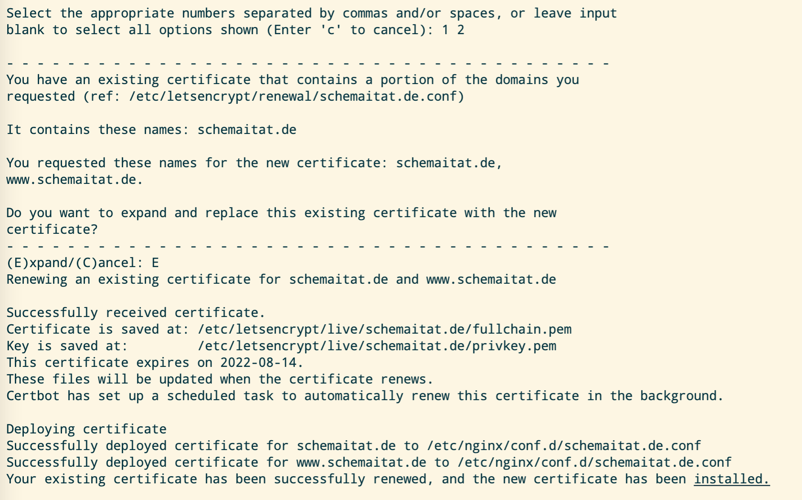
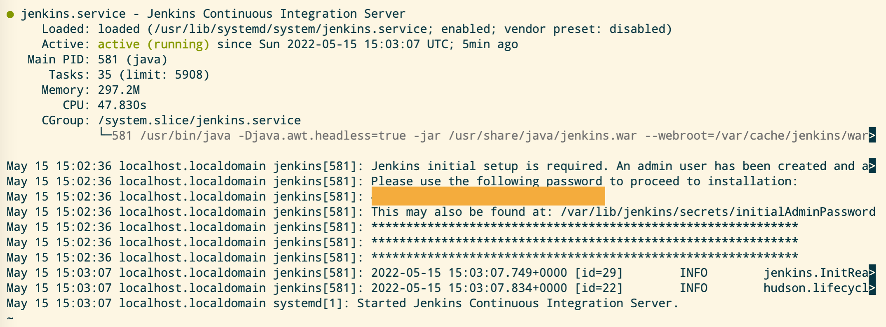
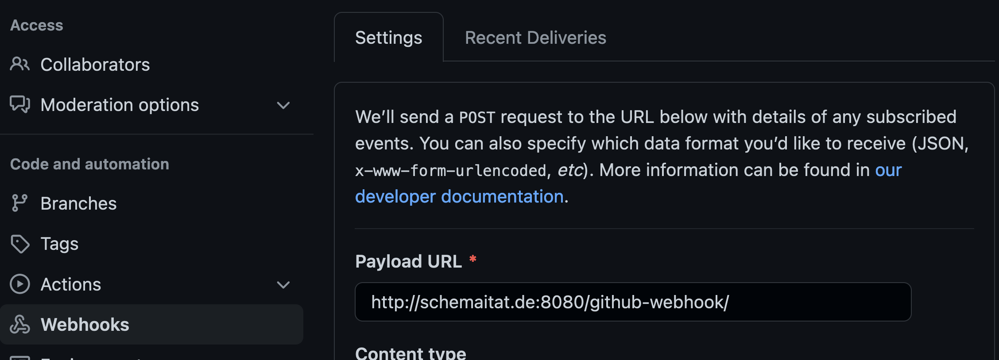
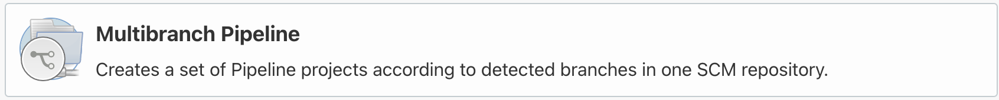
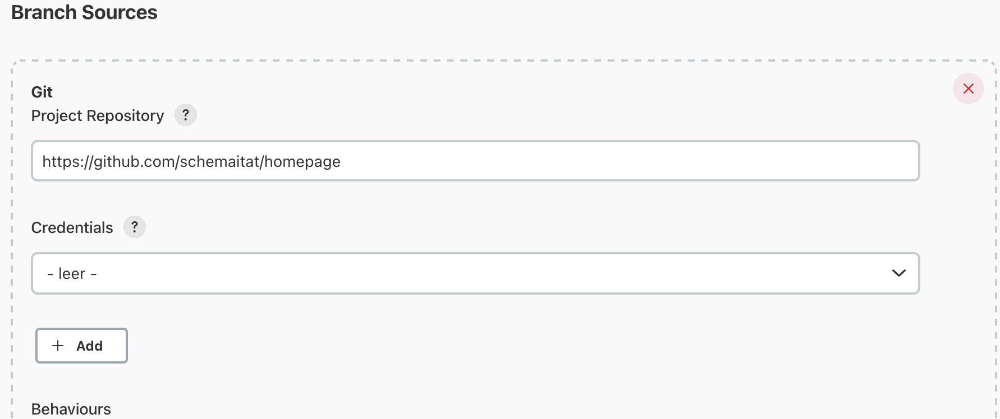

In this article, we go through the basic steps to create your fully customizable homepage using nginx, jenkins and hugo.
<!--more-->

## The host

### Setup

First, we need a server with a public ip address. Which vendor exactly you choose doesn't matter for this tutorial.


I prefer [linode](https://www.linode.com/) over other well-known providers. The setup is easy and focuses only on the information you need. For this tutorial, I created a *nanonode* with 1 CPU and 1 Gi memory.
Independent of usage this one node costs 5$ per month and is all we need.



 
    As an operating system I chose CentOS, as it is well-known for its reliability and security.



### SSH

The first time you set up your node you probably only have a password and an IP address to log in. We want to use *ssh*, which is more secure and easy to handle. To this end, we first generate a key pair on the local machine with `ssh-keygen` and then copy the public key to the remote host by using

```bash
ssh-copy-id root@172.105.67.187 
```

Now you should be able to log in to your machine without using a password.


We start by using the `root` user for the whole tutorial. In another tutorial, we will configure our machine in more detail and add some security features.



If you wonder why I post the actual IP address of the node, it's safe. IP addresses are no credentials and are publicly accessible to anyone. If you want to get the IP address of a webpage like googe.com you may use
```bash
nslookup google.com
```
However, you should never expose the private ssh key or the password for the root user to the public.


## First steps on the host

Before we start, we log in to our node to update and install some basic tools.

```bash
yum -y update
yum -y install wget tar git
```

### Firewall
By default, on CentOS, a firewall is enabled and has no holes. For our homepage, we need two services to be accessible from the public. The webpage itself, initially served on the http port 80 and after setting up TLS on port 443, and the jenkins web app on port 8080.

```bash
    # get some basic information about the firewall
    firewall-cmd --state
    firewall-cmd --get-default-zone
    firewall-cmd --zone=public --list-all
    # open ports
    firewall-cmd --zone=public --add-port=8080/tcp --permanent
    firewall-cmd --zone=public --add-port=80/tcp --permanent
    firewall-cmd --zone=public --add-port=443/tcp --permanent
    # reload and verify
    firewall-cmd --reload
    firewall-cmd --zone=public --list-all
```

## DNS
To access the services from the public internet, we need a domain. The domain provider makes this address publicly resolvable. In the settings of your domain, you have to create an A-record with your nodes IP address.




It may take up to 24h for the change to be active.


## Packages
### nginx
Next, we install a webserver called nginx, which hosts the homepage. Check out the [nginx](https://docs.nginx.com/nginx/admin-guide/installing-nginx/installing-nginx-open-source/) website for more details.

```bash
    yum install epel-release
    yum update
    yum install nginx
    # start service at reboot
    systemctl enable nginx
    # start service
    systemctl start nginx
    # check status
    systemctl status nginx
```

Since we want to use jenkins to build the static HTML and copy it to a destination from which nginx serves our homepage we have to grant permissions. We use the standard folder and a 
```bash
chmod -R jenkins:0 /usr/share/nginx/html
```
to change ownership of the standard folder.

At this point, we should already have a working webpage, which is accessible at http://your-domain, i.e. on port 80. In the next section, we will add TLS encryption to make the website secure and accessible via https.

### certbot

Next, we install certbot. This tool manages certificates and integrates well with nginx.
For more details have a look at this [tutorial](https://www.nginx.com/blog/using-free-ssltls-certificates-from-lets-encrypt-with-nginx/). 

First, we create an nginx config file, which later will be automatically modified by certbot.

```bash
cat > /etc/nginx/conf.d/schemaitat.de.conf << EOF
server {
    listen 80 default_server;
    listen [::]:80 default_server;
    root /usr/share/nginx/html;
    server_name schemaitat.de  www.schemaitat.de;
}
EOF
```


If you don't know the `EOF`notation, I recommend having a look at *heredocs*.


Now we will install *certbot*. If you are running another OS [this](https://certbot.eff.org/instructions?ws=nginx&os=centosrhel8) website is very useful to determine the correct installation method. For CentOS 8 we have to do the following:

```bash
    # install snapd
    yum install snapd
    systemctl enable --now snapd.socket
    ln -s /var/lib/snapd/snap /snap
    reboot
    # install certbot
    snap install core
    snap refresh core
    snap install --classic certbot
    ln -s /snap/bin/certbot /usr/bin/certbot
    # modify our nginx configuration file
    certbot --nginx
    nginx -t && nginx -s reload
```

The output should look something like this:



Now, we should be able to see our homepage, more precisely the nginx example page, being served at https://your-domain.

Finally, we want to automatically renew our certificates (which become invalid after 90 days). To this end, we add a cron job. Run `crontab -e` and add 

```
0 12 * * * /usr/bin/certbot renew --quiet
```

### hugo

Hugo is a static website generator. You only work with configuration files and markup language. No database is needed to build the final HTML for your homepage. Check out the [hugo](https://gohugo.io/) website for more information. To install hugo, we do the following:

```bash
    # download hugo (extended) prebuilt binary
    cd /tmp
    wget https://github.com/gohugoio/hugo/releases/download/v0.98.0/hugo_extended_0.98.0_Linux-64bit.tar.gz 
    tar -xzf hugo_extended_0.98.0_Linux-64bit.tar.gz
    chmod a+x hugo
    # move the binary to a location which is in $PATH
    mv hugo /usr/local/bin
    # cleanup
    rm hugo_extended_0.98.0_Linux-64bit.tar.gz
    # verify that hugo is executable
    which hugo
```


Make sure to download the latest (extended) hugo release.


### jenkins

Finally, we install jenkins. This tool is widely used for automation tasks and is fully customizable. However, our first job will be very simple. Jenkins clones the git repo with our hugo sources and builds the static HTML from it. 

Check out the [Jenkins](https://www.jenkins.io/doc/book/installing/linux/#red-hat-centos) install page for Cent-OS.

```bash
    sudo wget -O /etc/yum.repos.d/jenkins.repo \
        https://pkg.jenkins.io/redhat/jenkins.repo
    sudo rpm --import https://pkg.jenkins.io/redhat/jenkins.io.key
    sudo yum upgrade
    # Add required dependencies for the jenkins package
    sudo yum install java-11-openjdk
    sudo yum install jenkins
    # start jenkins service on start-up
    sudo systemctl enable jenkins
    sudo reboot
```

After reboot you can check the status of the service with `systemctl status jenkins`. The output shoud look like this: 



From the output you can extract the initial admin password, which you should change after first login. Furthermore, you can look at the process with `ps -afe | grep jenkins`, where you can also see that jenkins is running on port 8080.

## Jenkins pipeline

In our source repository we put a *Jenkinsfile*, wich defines the pipeline that should be executed. The idea ist to first build the static html with hugo and then copy the output to our root destination for nginx. This is an example for a very basic Jenkinsfile:
```jenkinsfile
pipeline{
    agent any

    stages {
        stage('Build static HTML') {
			steps{
                sh "rm -rf public"
                sh "hugo"
			}
		}   
        stage("Update HTML"){
            steps{
                sh'''#!/bin/bash
                rm -rf /usr/share/nginx/html/*
                cp -r public/* /usr/share/nginx/html
                '''
            }
        }
    }        
}
```

Next, we set up a webhook for our git repository. Each time a push happens to the repo we want to start the jenkins pipeline. That fully automates the build and deployment process.

The jenkins webhook is `http://your-domain:8080/github-webhook/`. The webhook can be defined in the settings of your source repository.



Finally, we create a new jenkins pipeline. First, create an element and select multibranch pipeline.



Next, select **Git** as branch source and provide the source repository for your hugo project and credentilas if needed.



After having saved the pipeline the first build starts.