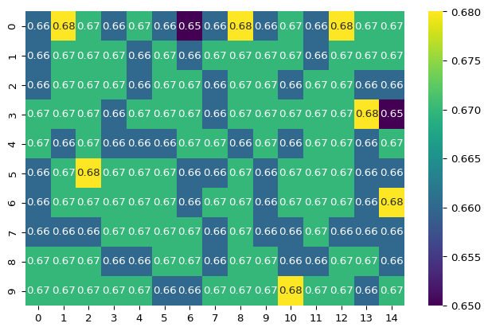



We explore how to use [polars](https://pola.rs/)' out of the box optimizations to
make parallelized computations. An interesting example is the confusion
of a classifier model and classical derived metrics like precision, recall
or the f1-score.




Polars is a blazingly fast DataFrame library implemented in Rust. It just had its 1.0 (actually 1.1) release and is a production ready tool with a stable an well designed api.



## Setup

Let us first generate some dummy data, which consists of labels (`y_true`) and
model scores (`y_prob`) with values in \[0,1\]. Furthermore we generate grouping
variables `id_1` and `id_2`, which will later be used to partition our data.

``` python
import polars as pl
import polars.selectors as cs

import numpy as np

np.random.seed(314)

def generate_data(n: int) -> pl.DataFrame:
  """
  Generate a DataFrame with random classifier output.

  Parameters:
    n (int): The number of rows in the DataFrame.

  Returns:
    pl.DataFrame: The generated DataFrame.

  """
  y_true = np.random.choice([True, False], n)
  y_prob = np.random.uniform(0, 1, n)

  id_1 = np.random.choice(15, n)
  id_2 = np.random.choice(10, n)

  schema = {
    "id_1": pl.Int32,
    "id_2": pl.Int32,
    "y_true": pl.Boolean,
    "y_prob": pl.Float32,
  }

  df = pl.DataFrame(
    {
      "id_1": id_1.tolist(),
      "id_2": id_2.tolist(),
      "y_true": y_true.tolist(),
      "y_prob": y_prob.tolist(),
    },
    schema=schema,
  )

  return df

print(generate_data(10).head())
```

    shape: (5, 4)
    ┌──────┬──────┬────────┬──────────┐
    │ id_1 ┆ id_2 ┆ y_true ┆ y_prob   │
    │ ---  ┆ ---  ┆ ---    ┆ ---      │
    │ i32  ┆ i32  ┆ bool   ┆ f32      │
    ╞══════╪══════╪════════╪══════════╡
    │ 13   ┆ 2    ┆ true   ┆ 0.827355 │
    │ 6    ┆ 0    ┆ false  ┆ 0.727951 │
    │ 13   ┆ 7    ┆ false  ┆ 0.26048  │
    │ 2    ┆ 3    ┆ false  ┆ 0.911763 │
    │ 7    ┆ 2    ┆ true   ┆ 0.260757 │
    └──────┴──────┴────────┴──────────┘

## Problem description

Metrics like precision, recall or the f1-score are defined entirely in terms of the
confusion (i.e. the number true positives, false positives, true negatives and false negatives).
These in turn are defined in terms of a threshold which defines the boolean predictions, being positive
if and only if the score is greater than or equal to the threshold.

Thus we can ask ourselves: Which threshold can we use to optimize for example the f1-score ?

The most naive approach is to compute all values of the f1-score for a large enough number of thresholds
to find some theta for which the f1-score is maximal.

The next question could be: Which thresholds can we use to optimize the f1-score on certain
partitions of our data ?

We will answer both questions at once since the first question is a special case (with a one element partition).

## Working with wide dataframes

An elegant solution to the problem is to use wide dataframes.
For each theta, we generate a boolean column `y_pred(theta)` and four columns
defining the confusion with respect to that theta. Furthermore, we add
one more column with our metric in question, lets say the f1-score. In total
we get 6\*len(theta) extra columns.

Now, the whole magic of why polars is such a great choice to solve this problem
is that all expression will be calculated in parallel, and in addition, we
can easily group our dataframe by our id (grouping) variables that define the
partition.

``` python
def add_y_pred(theta: list[float]) -> dict[str, pl.Expr]:
    """
    Add columns to the DataFrame with boolean predictions for different thresholds.
    """
    return {
        f"y_pred_{i}" : pl.col("y_prob") >= theta 
          for i, theta in enumerate(theta)
    }

def add_confusion(theta: list[float]) -> dict[str, pl.Expr]:
    """
    Add columns to the DataFrame with the confusion matrix for different thresholds.
    """
    return {
        f"tp_{i}" : pl.col("y_true") & pl.col(f"y_pred_{i}")  
          for i, theta in enumerate(theta)
    } | {
        f"fp_{i}" : ~pl.col("y_true") & pl.col(f"y_pred_{i}") 
          for i, theta in enumerate(theta)
    } | {
        f"tn_{i}" : ~pl.col("y_true") & ~pl.col(f"y_pred_{i}") 
          for i, theta in enumerate(theta)
    } | {
        f"fn_{i}" : pl.col("y_true")  & ~pl.col(f"y_pred_{i}") 
          for i, theta in enumerate(theta)
    }

def add_f1_score(theta: list[float]) -> dict[str, pl.Expr]:
    """
    Add columns to the DataFrame with the f1-score for different thresholds.
    Uses the confusion matrix.
    """
    return {
        f"f1_score_{i}" : 2 * pl.col(f"tp_{i}").sum() / (
            2 * pl.col(f"tp_{i}").sum() + pl.col(f"fp_{i}").sum() + pl.col(f"fn_{i}").sum()
          ) for i, theta in enumerate(theta)
    }

def select_best_theta(
  df: pl.DataFrame,
  theta: list[float],
) -> pl.DataFrame:
  """
  Select the best threshold.
  """
  df_theta = pl.DataFrame({"index" : range(len(theta)), "theta" : theta},
    schema={
      "index" : pl.UInt32, 
      "theta" : pl.Float32,
    })

  return (
    df
    .with_columns(
        theta_opt_ind = pl.concat_list(cs.starts_with("f1")).list.arg_max(),
        f1_opt = pl.concat_list(cs.starts_with("f1")).list.max(),
    )
    .join(
      df_theta,
      left_on="theta_opt_ind",
      right_on="index"
    )
    .rename({
      "theta" : "theta_opt",
    })
  )


def optimize(df: pl.DataFrame, theta: list[float], group_by: list[str]) -> pl.DataFrame:
  """
  Optimize the f1-score for different thresholds on different partitions of the data.
  """
  return (
    df.with_columns(
        **add_y_pred(theta),
    )
    .with_columns(
        **add_confusion(theta),
    )
    .group_by(group_by)
    .agg(
        **add_f1_score(theta)
    )
    .select(
        *group_by, cs.starts_with("f1")
    )
    .pipe(
      select_best_theta, theta
    )
    .select(
        *group_by, "theta_opt", "f1_opt",
    )
  )
```



``` python
theta = [0.1, 0.5]
groups=["id_1"]
df=generate_data(100)

df_wide = (
    df.with_columns(
        **add_y_pred(theta),
    )
    .with_columns(
        **add_confusion(theta),
    )
)
df_grouped = (
  df_wide
  .group_by(groups)
  .agg(
    **add_f1_score(theta)
  )
)

df_opt = (
  df_grouped
  .pipe(select_best_theta, theta)
  .select(
    *groups, "theta_opt_ind", "theta_opt", "f1_opt",
  )
)

print("DataFrame with confusion and boolean predictions:")
print(df_wide.head())
print("f1-scores for different thresholds and groups:")
print(df_grouped.head())
print("Optimal thresholds and f1-scores:")
print(df_opt.head())
```

    DataFrame with confusion and boolean predictions:
    shape: (5, 14)
    ┌──────┬──────┬────────┬──────────┬───┬───────┬───────┬───────┬───────┐
    │ id_1 ┆ id_2 ┆ y_true ┆ y_prob   ┆ … ┆ tn_0  ┆ tn_1  ┆ fn_0  ┆ fn_1  │
    │ ---  ┆ ---  ┆ ---    ┆ ---      ┆   ┆ ---   ┆ ---   ┆ ---   ┆ ---   │
    │ i32  ┆ i32  ┆ bool   ┆ f32      ┆   ┆ bool  ┆ bool  ┆ bool  ┆ bool  │
    ╞══════╪══════╪════════╪══════════╪═══╪═══════╪═══════╪═══════╪═══════╡
    │ 5    ┆ 6    ┆ false  ┆ 0.771075 ┆ … ┆ false ┆ false ┆ false ┆ false │
    │ 13   ┆ 8    ┆ true   ┆ 0.566425 ┆ … ┆ false ┆ false ┆ false ┆ false │
    │ 0    ┆ 6    ┆ true   ┆ 0.306617 ┆ … ┆ false ┆ false ┆ false ┆ true  │
    │ 13   ┆ 7    ┆ false  ┆ 0.977795 ┆ … ┆ false ┆ false ┆ false ┆ false │
    │ 6    ┆ 0    ┆ true   ┆ 0.88869  ┆ … ┆ false ┆ false ┆ false ┆ false │
    └──────┴──────┴────────┴──────────┴───┴───────┴───────┴───────┴───────┘
    f1-scores for different thresholds and groups:
    shape: (5, 3)
    ┌──────┬────────────┬────────────┐
    │ id_1 ┆ f1_score_0 ┆ f1_score_1 │
    │ ---  ┆ ---        ┆ ---        │
    │ i32  ┆ f64        ┆ f64        │
    ╞══════╪════════════╪════════════╡
    │ 0    ┆ 0.8        ┆ 0.545455   │
    │ 14   ┆ 0.615385   ┆ 0.363636   │
    │ 10   ┆ 0.444444   ┆ 0.285714   │
    │ 6    ┆ 0.8        ┆ 0.75       │
    │ 9    ┆ 0.666667   ┆ 0.571429   │
    └──────┴────────────┴────────────┘
    Optimal thresholds and f1-scores:
    shape: (5, 4)
    ┌──────┬───────────────┬───────────┬──────────┐
    │ id_1 ┆ theta_opt_ind ┆ theta_opt ┆ f1_opt   │
    │ ---  ┆ ---           ┆ ---       ┆ ---      │
    │ i32  ┆ u32           ┆ f32       ┆ f64      │
    ╞══════╪═══════════════╪═══════════╪══════════╡
    │ 0    ┆ 0             ┆ 0.1       ┆ 0.8      │
    │ 14   ┆ 0             ┆ 0.1       ┆ 0.615385 │
    │ 10   ┆ 0             ┆ 0.1       ┆ 0.444444 │
    │ 6    ┆ 0             ┆ 0.1       ┆ 0.8      │
    │ 9    ┆ 0             ┆ 0.1       ┆ 0.666667 │
    └──────┴───────────────┴───────────┴──────────┘



## More data

Now, lets see if we can handle more data. Note that the output is generated on
a single core machine and hence the parallelization is not any help here, however
I think that the result is still quite impressive. PS: I tried to implement the same logic
in pandas, however the performance was not even close to the one of polars and I got a lot
of warnings and errors about too many columns.
Feel free to benchmark this on your own or any other machine.
On my 8 core 16 GB machine, the following code runs in approximately one second.

``` python
import psutil
print(f"CPU: {psutil.cpu_count()}")
print(f"Memory: {psutil.virtual_memory().total / 1024 ** 2} MB")
```

    CPU: 8
    Memory: 16384.0 MB

``` python
groups=["id_1", "id_2"]
df = generate_data(1_000_000)
```

``` python
%%time
# use 100 equidistant thresholds
opt = optimize(df, np.arange(0,1, 0.01), groups)
print(opt.head(5))
```

    shape: (5, 4)
    ┌──────┬──────┬───────────┬──────────┐
    │ id_1 ┆ id_2 ┆ theta_opt ┆ f1_opt   │
    │ ---  ┆ ---  ┆ ---       ┆ ---      │
    │ i32  ┆ i32  ┆ f32       ┆ f64      │
    ╞══════╪══════╪═══════════╪══════════╡
    │ 14   ┆ 2    ┆ 0.0       ┆ 0.66452  │
    │ 14   ┆ 7    ┆ 0.0       ┆ 0.664354 │
    │ 4    ┆ 6    ┆ 0.0       ┆ 0.67379  │
    │ 0    ┆ 3    ┆ 0.0       ┆ 0.672407 │
    │ 7    ┆ 0    ┆ 0.0       ┆ 0.659814 │
    └──────┴──────┴───────────┴──────────┘
    CPU times: user 6.83 s, sys: 111 ms, total: 6.94 s
    Wall time: 1.2 s

``` python
import seaborn as sns
sns.heatmap(
  opt
  .with_columns(f1_opt=pl.col("f1_opt").round(2))
  .sort("id_1", "id_2")
  .pivot(on="id_1", index="id_2", values= "f1_opt")
  .drop("id_2"),
  annot=True,
  cmap="viridis",
)
```



Feel free to experiment with the code or to build a benchmark using different
techniques and tools.
