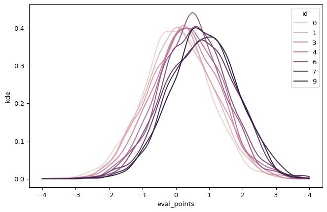



We will see how to use [polars](https://pola.rs/)' out of the box optimizations to
make parallelized kernel density estimations. To this end, I created the [polars_kde](https://github.com/schemaitat/polars_kde) package, which is a polars plugin backed by some Rust code.




At the time of writing the `polars_kde` package has version `0.1.4` and is available on [pypi](https://pypi.org/project/polars-kde/).




By now, the standard reference for writing polars plugins is Marco Gorelli's excellent tutorial [here](https://marcogorelli.github.io/polars-plugins-tutorial/). If you want to learn how the internals of polars plugins work, please have a look at his tutorial.




Some advertisement: If you haven't already checked out my other polars plugin [polars_sim](https://github.com/schemaitat/polars_sim), make sure to have a look.
The plugin enables **very** fast approximate joins on string columns (fuzzy matching but with a twist). The implementation is entirely written from scratch in Rus and uses n-gram vectorization of strings with a fast cosine similarity computation using sparse matrices.



## Introduction

Kernel Density Estimation (KDE) is a non-parametric way to estimate the probability density function of a random variable. I recently created a basic [marimo](https://marimo.app/) notebook on how to visualize feature distributions and drift over time, possibly grouped by another categorical variable, e.g. the target of a classifier. See my repository [marimo_notebooks](https://github.com/schemaitat/marimo_notebooks) for more details or check out the interactive notebook [here](https://marimo.app/gh/schemaitat/marimo_notebooks/main?entrypoint=notebook%2Ffeature_drift.py).

While working on this notebook, I realized that the computations usually involve multiple kde's for different slices of the data. In order to have a polars built-in method to compute kde's, I created the `polars_kde` package. This enables optimized comutations and polars-native code (as opposed to for example using `scipy`).

The updated notebook with the new polars plugin in place can be found [here](https://github.com/schemaitat/marimo_notebooks/blob/main/notebook/feature_drift_fast.py).

If you (trust me) and want to run the notebook in your local environment, simpliy fire

``` bash
uv tool run marimo edit https://github.com/schemaitat/marimo_notebooks/blob/main/notebook/feature_drift_fast.py
```



Or as an interactive [marimo](https://marimo.io/) notebook (loading the packages can take a few seconds):




The interactive marimo notebook uses the `scipy` implementation. The `polars_kde` package is not yet available as wasm build.



<iframe src="/marimo/feature_drift/index.html" width="100%" height="700" frameborder="0">
</iframe>



Adding interactive marimo notebooks to a static blog is as easy as adding an iframe for wasm html files. See the [docs](https://docs.marimo.io/guides/exporting/#export-to-wasm-powered-html). The marimo notebooks are self-contained and can be hosted on any static file server.

I integrated this into my workflow by adding a `marimo` folder containing all the notebooks. Then, each notebook is exported to a same named folder in the `public` folder (where the rendered blog html lives).

In my Jenkins pipline, I *install* the notebooks as follows:

``` bash
#!/bin/bash

if [ -z "$1" ]; then
    echo "Usage: $0 <output_dir>"
    echo "  output_dir: directory to store the rendered notebooks"
    exit 1
fi

output_dir=${1:-public}/marimo

# create a temp directory to store the rendered notebooks
mytmpdir=$(mktemp -d 2>/dev/null || mktemp -d -t 'mytmpdir')


if [ -d $output_dir ]; then
    echo "Output directory already exists. Clearing it."
    rm -rf $output_dir
else
    mkdir -p $output_dir
fi

for notebook in "marimo/*.py"; do
    # remove .py ending
    dir_name=$(basename $notebook)
    dir_name="${dir_name%.*}"
    echo -ne 'Y' | uv run marimo export html-wasm --sandbox --mode run $notebook -o $mytmpdir/$dir_name
    mv $mytmpdir/$dir_name ${output_dir}/$dir_name
done


trap "rm -rf $mytmpdir" EXIT SIGINT SIGTERM SIGQUIT SIGKILL
```



## Rust side

On the rust side of things, all we need to do is wrapping an already existing functionality into a polars expression. Often, this is the standard approach on how to create polars plugins. Onother example is for example the [polars-reverse-geocode](https://github.com/MarcoGorelli/polars-reverse-geocode) plugin.

``` rust
use kernel_density_estimation::prelude::*;
use polars::prelude::*;
use polars_core::utils::align_chunks_binary;
use pyo3_polars::derive::polars_expr;
use serde::Deserialize;

#[derive(Deserialize)]
struct KdeKwargs {
    eval_points: Vec<f32>,
}

fn compute_kde(sample_points: Vec<f32>, eval_points: Vec<f32>) -> Vec<f32> {
    let kde = KernelDensityEstimator::new(sample_points, Silverman, Normal);
    kde.pdf(&eval_points)
}


#[polars_expr(output_type_func=same_output_type)]
fn kde_agg(inputs: &[Series], kwargs: KdeKwargs) -> PolarsResult<Series> {
    let values = &inputs[0].f32()?;
    let eval_points = kwargs.eval_points;

    let sample_points = values.into_no_null_iter().collect::<Vec<_>>();

    let samples = compute_kde(sample_points, eval_points);

    Ok(Series::new(PlSmallStr::EMPTY, samples))
}
```



You see that I use `Normal` as kernel and `Silverman` as bandwidth estimator. This is a common default choice, but a future improvement would be to make these parameters configurable.



## Examples

To get the basic idea, we start with a simple example. We have a dataframe with two columns, `id` and `values`. We group by `id` and compute the kde for the `values` column. We work with a fixed set of evaluation points, which are the points at which the kde is evaluated.

``` python
import polars as pl
import polars_kde as pk

eval_points = [0.1, 0.2, 0.3, 0.4, 0.5, 0.6, 0.7, 0.8, 0.9]

df = pl.DataFrame({
    "id" : [0,0,0,0, 1, 1],
    "values" : [0.1, 0.2, 0.3, 0.4, 0.5, 0.6]
},
schema = {
    "id" : pl.UInt32,
    "values" : pl.Float32
})

df_kde = df.group_by("id").agg(kde = pk.kde("values", eval_points = eval_points))
print(df_kde)
```

    shape: (2, 2)
    ┌─────┬─────────────────────────────────┐
    │ id  ┆ kde                             │
    │ --- ┆ ---                             │
    │ u32 ┆ list[f32]                       │
    ╞═════╪═════════════════════════════════╡
    │ 1   ┆ [1.7249e-11, 0.000002, … 0.000… │
    │ 0   ┆ [1.816287, 2.407217, … 1.1300e… │
    └─────┴─────────────────────────────────┘

Now lets generate some more data and add a visualization:

``` python
import numpy as np
import polars as pl
import polars_kde as pk
import seaborn as sns

df = pl.DataFrame({
    "id" : np.random.randint(0, 10, 10_000),
    "values" : np.random.normal(0, 1, 10_000),
}).with_columns(
    values = pl.col("values") + pl.col("id") * 0.1
).cast({
    "values": pl.Float32
})

eval_points = [x/100 for x in range(-400, 400)]

df_kde = (
   df
  .group_by("id")
  .agg(
    kde = pk.kde("values", eval_points = eval_points),
  )
  .with_columns(
      # add the evaluation points as a column
      # for plotting
      eval_points=pl.lit(eval_points)
  )
  .explode("kde", "eval_points")
)

sns.lineplot(
    df_kde,
    x="eval_points",
    y="kde",
    hue="id",
)
```



See also the Readme of the [polars_kde](https://github.com/schemaitat/polars_kde) for some more examples on varying evaluation points.



The `kde` function works also on `group_by_dyanmic` groups and is particularly useful for timeseries
aggregations.



## Speed

Especially, for large dataframes and many groups, the speedup is significant. Compared to the `scipy` implementation, the `polars_kde` is faster even for a single operation faster. For illustration, let us look at some boilerplate code that can be used to generate more benchmarks.

``` python
import numpy as np
import polars as pl
import polars_kde as pk
import seaborn as sns
import time

def benchmark(n_groups, n_rows):
    df = pl.DataFrame({
        "id" : np.random.randint(0, n_groups, n_rows),
        "values" : np.random.normal(0, 1, n_rows),
    }).with_columns(
        values = pl.col("values") + pl.col("id") * 0.1
    ).cast({
        "values": pl.Float32
    })

    eval_points = [x/100 for x in range(-50, 50)]

    start = time.time()
    df_kde = (
       df
      .group_by("id")
      .agg(
        kde = pk.kde("values", eval_points = eval_points),
      )
    )
    end = time.time()

    df_bench = pl.DataFrame({
      "n_groups": [n_groups],
      "n_rows": [n_rows],
      "time": [end - start]
    })

    return df_bench

bench_n_groups = [1, 10, 100, 1000]
bench_n_rows = [10_000, 100_000, 500_000, 1_000_000, 2_000_000, 5_000_000]

# Include this to generate the plot.
# Here, I added the output on my local machine with 8 cores,
# since the build agent is single core and we would not see
# any parallelization.

# df_bench = pl.concat([
#     benchmark(n_groups, n_rows)
#     for n_groups in bench_n_groups
#     for n_rows in bench_n_rows
# ])


# sns.catplot(
#     df_bench,
#     x="n_rows",
#     y="time",
#     hue="n_groups",
#     kind="point"
# )
```


