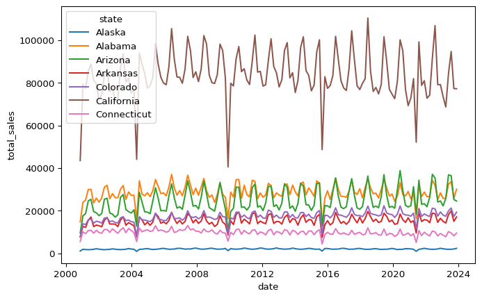

<meta name="mermaid-theme" content="forest"/>
<script  src="index_files/libs/quarto-diagram/mermaid.min.js"></script>
<script  src="index_files/libs/quarto-diagram/mermaid-init.js"></script>
<link  href="index_files/libs/quarto-diagram/mermaid.css" rel="stylesheet" />



**Things you get**
- A quick overview of how to integrate quarto with hugo.

**Prerequisites**
- Basic Linux and bash knowledge.



## Introduction

Writing scientific articles with reproducible code execution has been on my to-do list for quite some time. Recently, I came across Quarto, a tool that allows you to execute Python cells and save the output to markdown. This process, known as rendering, generates markdown files that can be used by Hugo to generate static HTML.

Quarto provides a seamless integration between Python and Hugo, making it easy to create interactive and dynamic content.

## Setup

First, we need to install Quarto. This can be done via an official installer or by installing a specific release. For the latter the following script can be used.

``` bash
# install quarto to ${HOME}/bin
QUARTO_VERSION=1.4.554

URL="https://github.com/quarto-dev/quarto-cli/releases/download/"\
"v${QUARTO_VERSION}/quarto-${QUARTO_VERSION}-linux-amd64.tar.gz"

curl -o quarto.tar.gz -L $URL
tar -zxvf quarto.tar.gz
    --strip-components=1 \
    -C ${HOME}
rm quarto.tar.gz
```



Make sure to use a release specific to your operating system. I use the linux-amd64 release.



Next, I needed to add a `index.qmd` file to the project root path to be able to call `quarto render` from that directory. This will render all `*.qmd` files in the project.

For the python runtime it is best practice to set up a virtual environment and install the basic jupyter requirement. I prefer `poetry` for dependency management and `uv` for creating virtual environments.
So, for me that basic step is

``` bash
uv venv --python 3.9 && source .venv/bin/activate && poetry install
```

where my `pyproject.toml` looks like this:

``` toml
[tool.poetry]
name = "homepage"
version = "0.1.0"
description = ""
authors = ["André Schemaitat <a.schemaitat@gmail.com>"]
readme = "README.md"
package-mode = false

[tool.poetry.dependencies]
python = "^3.9"
notebook = "^7.2.0"


[build-system]
requires = ["poetry-core"]
build-backend = "poetry.core.masonry.api"
```

The `pyproject.toml` can also be generated by calling `poetry init`.

I added the `package-mode = false` setting, since I use poetry for dependency management only, i.e. housekeeping my venv.



Don't forget to activate your venv when calling `quarto render`.



Finally, you can (and it makes sense) add a configuration file `_quarto.yml` to the root path, which contains the global quarto configuration. Right now, I use the following setup:

``` yaml
project:
  type: hugo
      
format:
  hugo-md: 
    mermaid: 
      theme: forest

jupyter: python3

editor: 
  render-on-save: true
```

However, you can also add quarto settings per document. These will then be merged with the global settings.

## Workflow

The main steps of creating content with quarto and hugo are depicted in <a href="#fig-workflow" class="quarto-xref">Figure 1</a>.

<div id="fig-workflow">

<pre class="mermaid mermaid-js" data-label="fig-workflow">
graph LR;
    A(qmd) --&gt; 
    B(jupyter)
    --&gt; C(md)
    --&gt; D(Pandoc)
    --&gt; E(hugo md)
    A --&gt;|quarto render| E
    E --&gt;|hugo serve| F(html)
</pre>

Figure 1: Quarto & hugo workflow.
</div>

We first write some content, a quarto markdown file (\*.qmd), that might contain [diagrams](https://quarto.org/docs/authoring/diagrams.html) (mermaid, graphviz, ...) or python code. Next, quarto renders the file and generates output with the specified format. You can choose from many different output formats; we will need `hugo-md`, which is a hugo compatible markdown file.

You can then run `quarto preview` from the root path, which will run a `hugo serve` command for you and call `quarto render` on changes.

## IDE

For VS Code you can install the Quarto extension. This gets you some basic shortcuts for running Quarto commands (e.g. quarto preview).
Besides that, for me really useful is the preview functionality for diagrams. It lets you create mermaid diagrams or graphviz graphs on the fly and see the changes in a split screen live view !

<figure>

<figcaption aria-hidden="true">Diagram preview</figcaption>
</figure>

## Deployment

For the deployment of this homepage, I use a simple Jenkins CI/CD Pipeline. Here CI means building the website html and CD means simply copying the html to a folder on the same machine that is served by nginx.
When using quarto we have the additional `quarto render` step, that has to be executed before running `hugo`, which builds the html content. As described earlier we also need to install some binaries and a python environment to be able to run `quarto render`.
Installing the required binaries into `${HOME}/bin` on a CentOS machine could look like this:

``` bash
#!/bin/bash
# filename: install.sh

rm -rf ${HOME}/bin
mkdir -p ${HOME}/bin
mkdir -p ${HOME}/poetry

# install quarto
export QUARTO_VERSION=1.4.554

curl -o quarto.tar.gz -L \
    "https://github.com/quarto-dev/quarto-cli/releases/download/"\
"v${QUARTO_VERSION}/quarto-${QUARTO_VERSION}-linux-amd64.tar.gz"

tar -zxvf quarto.tar.gz \
    --strip-components=1 \
    -C ${HOME}
rm quarto.tar.gz

# install uv
export UV_RELEASE=0.1.44

curl -o uv.tar.gz -L \
    "https://github.com/astral-sh/uv/releases/download/"\
"${UV_RELEASE}/uv-x86_64-unknown-linux-gnu.tar.gz"

tar -zxvf uv.tar.gz \
    --strip-components=1 \
    -C ${HOME}/bin

rm uv.tar.gz

# install hugo
export HUGO_RELEASE=0.108.0

curl -o hugo.tar.gz -L \
    "https://github.com/gohugoio/hugo/releases/download/"\
"v${HUGO_RELEASE}/hugo_extended_${HUGO_RELEASE}_Linux-64bit.tar.gz"

tar -zxvf hugo.tar.gz -C ${HOME}/bin
rm hugo.tar.gz

# install poetry
curl -sSL https://install.python-poetry.org | POETRY_HOME=${HOME}/bin/poetry python3 -

# make all binaries executable
chmod -R +x ${HOME}/bin
```

My current `Jenkinsfile` looks like this:

``` jenkins
pipeline{
    agent any

    environment{
        // look at local installation of hugo first if a 
        // installation with the wrong version exists
        PATH="${HOME}/bin:${HOME}/bin/poetry/bin:${WORKSPACE}:${PATH}"
    }

    stages {
        stage('Update submodules') {
            steps{
                sh "git submodule update --init --recursive"
            }
        }   

        stage('Install binaries'){
            steps{
                sh'''#!/bin/bash
                chmod +x ./scripts/install.sh
                ./scripts/install.sh
                '''
            }
        }

        stage('Create python venv and install packages'){
            steps{
                sh'''#!/bin/bash
                # as required by pyproject
                uv venv --python 3.9
                source .venv/bin/activate
                poetry install
                '''
            }
        }

        stage('Build static HTML') {
            steps{
                sh'''#!/bin/bash
                set -x
                sed -i "s/{{COMMIT}}/${GIT_COMMIT:0:6}/g" config.toml
                sed -i "s/{{DATE}}/$(date '+%A %e %B %Y')/g" config.toml
                '''
                sh "rm -rf public"
                sh "poetry run quarto render && hugo --cacheDir $HOME/hugo_cache"
            }
        }   

        stage("Update HTML"){
            steps{
                sh'''#!/bin/bash
                set -x
                rm -rf /usr/share/nginx/html/*
                cp -r public/* /usr/share/nginx/html
                '''
            }
        }
    }        
}
```

The relevant parts are adding `${HOME}/bin` to the `$PATH`, installing the binaries with our magic script, creating the venv with the correct python version, installing the python project and running the quarto render hugo workflow.

## Python Example

Finally, because it is so much fun, I want to showcase a simple python example. It uses the fantastic tool [polars](https://pola.rs/). The data file lives in the root path of this post and is called `clean_data.csv`.



Since polars is my newly loved :heart: and absolute favorite data processing library (thanks to Ritchie Vink), I will hopefully find some time to write a few posts about this tool and how a data scientist can benefit from it.



``` python
import polars as pl

df = (
  pl.scan_csv("clean_data.csv")
  .select(["year", "month", "stateDescription", "price", "sales"])
  .rename({
    "stateDescription" : "state"
  })
  .filter(pl.col("state").str.contains("^(A|B|C)"))
  .with_columns(
    date=pl.date(pl.col("year"), pl.col("month"), 1),
  )
  .group_by_dynamic(
    "date",
    every="60d",
    group_by="state",
  )
  .agg(
    total_sales = pl.col("sales").sum(),
  )
)
```

``` python
import seaborn as sns
sns.lineplot(
    data=df.collect(),
    x="date",
    y="total_sales",
    hue="state"
)
```





Since we are running a jupyter python kernel we are also allowed to run inline shell scripts with the `%%sh` cell magic !

``` python
%%sh
set -x
echo "Hello world from $(hostname) !"
pwd
ls -alh . | grep -i csv
curl wttr.in/Münster
set +x
```

    ++ hostname
    + echo 'Hello world from MacBook-Pro.local !'
    + pwd

    Hello world from MacBook-Pro.local !
    /Users/andre/projects/homepage/content/posts/quarto-intro

    + ls -alh .
    + grep -i csv

    -rw-rw-r--@  1 andre  staff   4,9M  7 Apr  2024 clean_data.csv

    + curl wttr.in/Münster
      % Total    % Received % Xferd  Average Speed   Time    Time     Time  Current
                                     Dload  Upload   Total   Spent    Left  Speed
      0     0    0     0    0     0      0      0 --:--:-- --:--:-- --:--:--     0100  8732  100  8732    0     0  33545      0 --:--:-- --:--:-- --:--:-- 33584

    Weather report: Münster

                    Overcast
           .--.     +4m(0) °C       
        .-(    ).   ↙ 19 km/h      
       (___.__)__)  10 km          
                    0.0 mm         
                                                           ┌─────────────���                                                       
    ┌──────────────────────────────┬───────────────���───────┤  Sat 15 Mar ├───────────────────���───┬────────────────────────────��─┐
    │            Morning           │             Noon      └──────┬──────┘     Evening           │             Night            │
    ├────────���─────────────────────┼──────────��───────────────────┼──────────────────────────────┼───────────────���──────────────┤
    │               Overcast       │  _`/"".-.     Patchy rain ne…│               Overcast       │               Cloudy         │
    │      .--.     +3(-1) °C      │   ,\_(   ).   +5(1) °C       │ ;5;240;1m     .--.     +6(3) °C       │      .--.     +4(1) °C       │
    │   .-(    ).   ↙ 17-23 km/h   │    /(___(__)  ↙ 19-23 km/h   │   .-(    ).   ��� 15-22 km/h   │   .-(    ).   ↓ 15-23 km/h   │
    │  (___.__)__)  10 km          │      ‘ ‘ ‘ ‘  10 km          │  (___.__)__)  10 km          │  (___.__)__)  10 km          │
    │               0.0 mm | 0%    │     ‘ ‘ ‘ ‘   0.0 mm | 75%   │               0.0 mm | 0%    │               0.0 mm | 0%    │
    └──────────────────────────────┴──────────────────���───────────┴────────────────────��─────────┴──────────────────────────────┘
                                                           ┌─────��───────┐                                                       
    ┌─────���────────────────────────┬───────��───────────────┤  Sun 16 Mar ├───────────��───────────┬──────────────────────────────┐
    │            Morning           │             Noon      └──���───┬──────┘     Evening           │             Night            │
    ├��─────────────────────────────┼──────────────────────────────┼─────���────────────────────────┼───────��──────────────────────┤
    │     \   /     Sunny          │     \   /     Sunny          │               Overcast       │    \  /       Partly Cloudy  │
    │      .-.      +3(0) °C       │      .-.      +7(5) °C       │      .--.     +8(6) °C       │  _ /"".-.     +6(3) °C       │
    │   ― (   ) ―   ↓ 10-13 km/h   │   ― (   ) ―   ↓ 10-12 km/h   │ 8;5;240;1m  .-(    ).   ↓ 12-17 km/h   │ 6m   \_(   ).   ↘ 10-18 km/h   │
    │      `-’      10 km          │      `-’      10 km          │  (___.__)__)  10 km          │    /(___(__)  10 km          │
    │     /   \     0.0 mm | 0%    │     /   \     0.0 mm | 0%    │               0.0 mm | 0%    │               0.0 mm | 0%    │
    └──────────────────────────────��──────────────────────────────┴──────────────────────────────┴────���─────────────────────────┘
                                                           ┌─────────────┐                                                       
    ┌──────────────────────────────┬──────────────────────���┤  Mon 17 Mar ├───────────────────────┬──���───────────────────────────┐
    │            Morning           │             Noon      └──────┬──────┘     Evening           │             Night            │
    ├───────────────���──────────────┼─────────────────��────────────┼──────────────────────────────┼──────────────────────���───────┤
    │    \  /       Partly Cloudy  │     \   /     Sunny          │     \   /     Sunny          │     \   /     Clear          │
    │  _ /"".-.     +4(1m) °C       │      .-.      +8(4) °C       │      .-.      +7(4) °C       │      .-.      +3(0) °C       │
    │    \_m(   ).   ↙ 18-24 km/h   │   ― (   ) ―   ← 21-24 km/h   │   ― (   ) ―   ← 17-25 km/h   │   ― (   ) ―  m ← 16-27 km/h   │
    │    /(___(__)  10 km          │      `-’      10 km          │      `-’      10 km          │      `-’      10 km          │
    │               0.0 mm | 0%    │     /   \     0.0 mm | 0%    │     /   \     0.0 mm | 0%    │     /   \     0.0 mm | 0%    │
    └──────────────────────────────┴────���─────────────────────────┴──────��───────────────────────┴──────────────────────────────┘
    Location: Münster, Regierungsbezirk Münster, Nordrhein-Westfalen, Deutschland [51.9501317,7.61330165026119]

    Follow @igor_chubin for wttr.in updates

    + set +x


