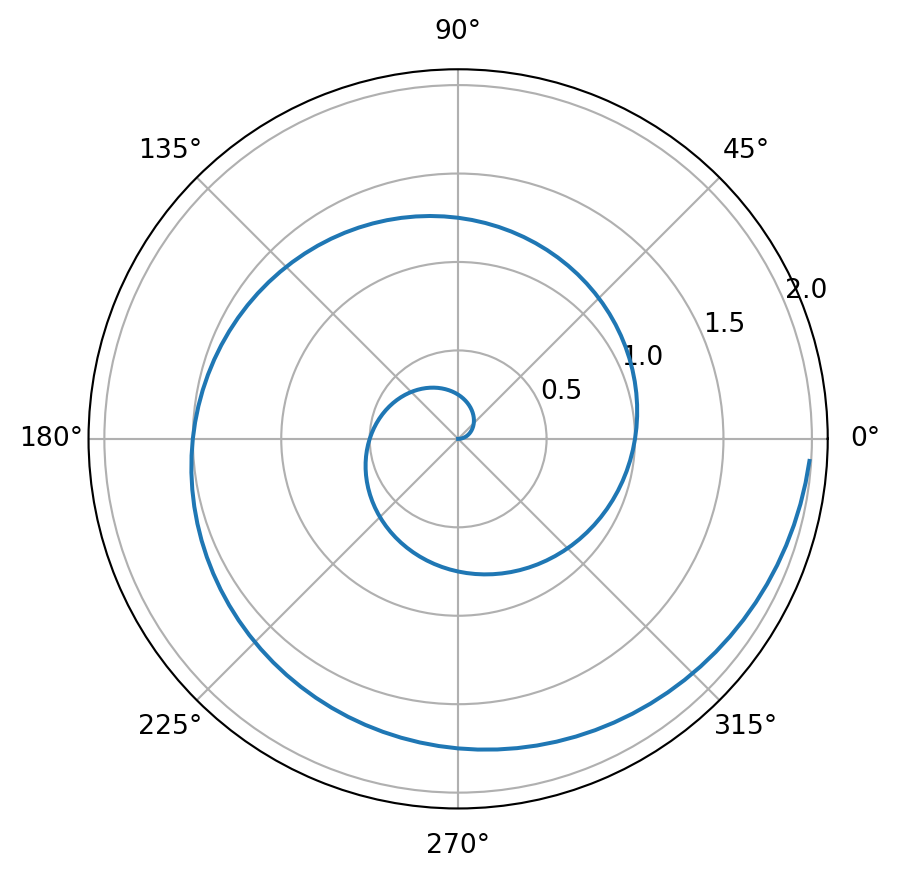

## Polar Axis

For a demonstration of a line plot on a polar axis, see <a href="#fig-polar" class="quarto-xref">Figure 1</a>.

<details class="code-fold">
<summary>Code</summary>

``` python
# some comment
import numpy as np
import matplotlib.pyplot as plt

r = np.arange(0, 2, 0.01)
theta = 2 * np.pi * r
fig, ax = plt.subplots(subplot_kw={'projection': 'polar'})
ax.plot(theta, r)
ax.set_rticks([0.5, 1, 1.5, 2])
ax.grid(True)
plt.show()
```

</details>

